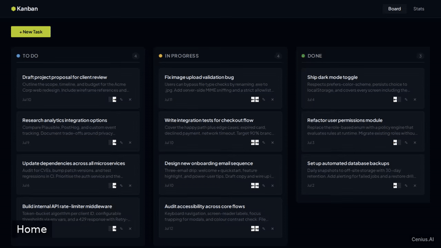
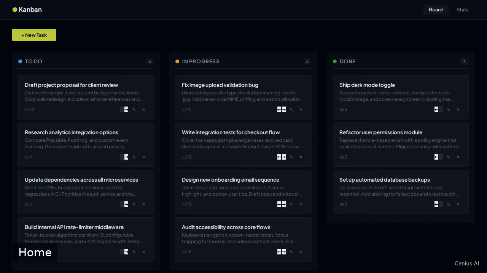
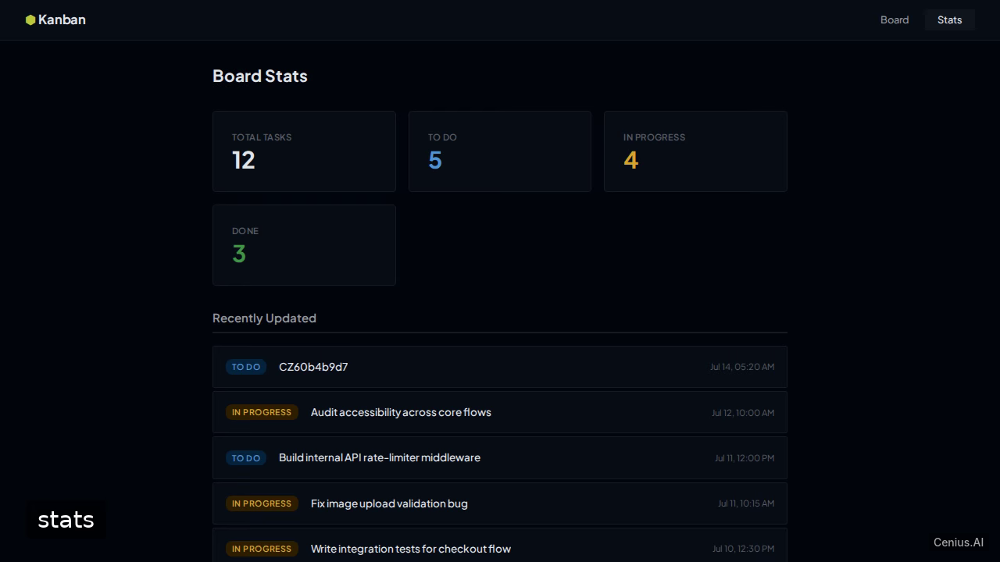
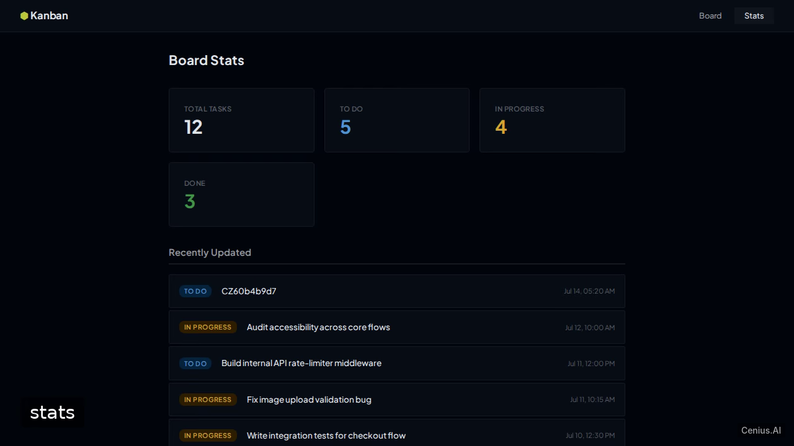

# Kanban Task Board — complete Vite kanban board example app

Build a single-page Kanban board application using Vite + React + TypeScript. That's **Kanban Task Board** — a Apache-2.0-licensed, open-source kanban board in Vite you can self-host and modify freely. Fork Kanban Task Board, run it, or [remix it on cenius.ai](https://cenius.ai/marketplace/p/kanban-task-board?ref=gh&utm_campaign=kanban-task-board-vite) for a custom Kanban Task Board build with full rebrand rights.

  

> **▶ [Open & edit in cenius.ai](https://cenius.ai/marketplace/p/kanban-task-board?ref=gh&utm_campaign=kanban-task-board-vite)** — one click to an editable workspace: describe changes in plain English, get an instant preview, one-click deploy and host. Modifications made on the platform come with full rebrand & relicense rights.

_Local clone? See [Quick start](#quick-start) below. cenius.ai is the zero-setup path._

## Demo

▶ **[Watch the full demo video](https://cenius.ai/marketplace/p/kanban-task-board?ref=gh&utm_campaign=kanban-task-board-vite)** — the complete walkthrough, playing on the project's cenius.ai page · [MP4 file](.github/media/demo.mp4)

## Screenshots

  

## Quick start

See [`INSTALL.md`](INSTALL.md) for full setup and usage instructions.

## Features

- Three-column board
- Drag-and-drop cards
- Add task
- Edit task
- Delete task
- Persistent storage
- Task detail view
- Board stats page
- Seed demo tasks
- Multi-screen navigation

## Architecture

The repository contains 36 files of Vite source, organised under `src/`. For environment-specific setup, see [`INSTALL.md`](INSTALL.md).

## Usage guide

After starting the development server with `npm run dev`, open your browser to [http://localhost:5173](http://localhost:5173).

### Routes and Screens

#### Board (`/`)
- The main Kanban board displays three columns: **To Do**, **In Progress**, and **Done**.
- Drag and drop task cards between columns to change their status.
- Use the **Add Task** form (implemented by `AddTaskForm.tsx`) to create a new task with a title and optional description.

#### Task Detail (`/task/:id`)
- Click on any task card to navigate to its detail page.
- The page shows the task title, description, status badge, created/updated timestamps.
- Action buttons allow you to:
  - **Edit**: Open `EditTaskModal` to modify title, description, or status.
  - **Move Left** / **Move Right**: Advance or regress the task to the adjacent column.
  - **Delete**: Remove the task permanently.

#### Stats (`/stats`)
- Accessible via the navigation bar link **Stats**.
- Displays overall board statistics:
  - Total number of tasks
  - Count of tasks in each column
  - A list of recently updated tasks, each linking to its detail view.

### Data Persistence
All tasks are stored in the browser’s `localStorage`. The app seeds a set of demo tasks on first load (`seedData.ts`). Modifications (add, edit, move, delete) are persisted automatically.

### Notes
- No login or authentication is required.
- The application is a single-page app; all navigation happens client-side.

_Full guide: [`USAGE.md`](USAGE.md)_

## FAQ

### Can I deploy Kanban Task Board on my own infrastructure?

Everything you need ships in this repo: clone it, run `./install.sh` to install dependencies and seed demo data, then follow [`INSTALL.md`](INSTALL.md) to start it. No external services required.

### Is it OK to ship Kanban Task Board as part of a product?

Yes — Apache-2.0-licensed, so commercial use, modification, and distribution are all permitted. Read the full terms in [LICENSE](LICENSE).

### What powers Kanban Task Board under the hood?

Vite end-to-end. Every file you need to run the app is here in this repository — code, configuration, seed data. Highlights include drag-and-drop cards.

### Is there a no-code way to modify Kanban Task Board?

Non-developers can use [cenius.ai](https://cenius.ai/marketplace/p/kanban-task-board?ref=gh&utm_campaign=kanban-task-board-vite) to make changes. Describe your goal in everyday language and the platform delivers an updated, ready-to-run project — zero coding on your part.

### Is it possible to white-label Kanban Task Board for a client?

Yes. You can edit the source directly under the MIT license, or [remix it on cenius.ai](https://cenius.ai/marketplace/p/kanban-task-board?ref=gh&utm_campaign=kanban-task-board-vite) — the platform route grants full rebrand and relicense rights over your derivative.

## License & rebranding

Released under the [Apache License 2.0](LICENSE) (© 2026 Cenius AI) — free for personal and commercial use. The Cenius name/logo are trademarks (see NOTICE).

**Need a customized version?** [Remix this app on cenius.ai](https://cenius.ai/marketplace/p/kanban-task-board?ref=gh&utm_campaign=kanban-task-board-vite) — modifications made on the platform come with **full rebrand & relicense rights** over your derivative.

## Built with cenius.ai

This entire application — code, design, seeded demo data — was generated on **[cenius.ai](https://cenius.ai)** from a plain-English description.

- 🚀 [Build your own app on cenius.ai](https://cenius.ai)
- 🎛️ [Remix Kanban Task Board on the marketplace](https://cenius.ai/marketplace/p/kanban-task-board?ref=gh&utm_campaign=kanban-task-board-vite) — open it in a workspace, prompt for changes, and ship your own version.

More open-source apps: [the Cenius-ai catalog](https://github.com/Cenius-ai) · [showcase index](https://github.com/Cenius-ai/showcase)
